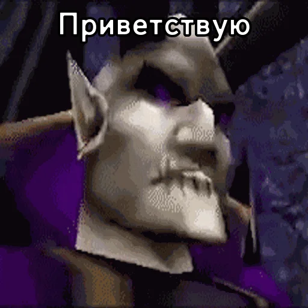
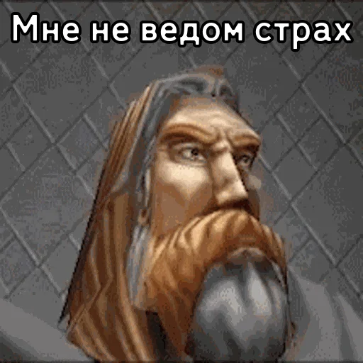
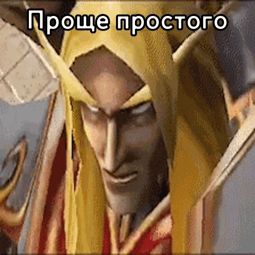

# Warcraft III Sticker bot

    <h2>Intro</h2>
    
    

    
Помните <b>Warcraft III</b>?

А он до сих пор есть... Он продолжает жить.

---

**Warcraft III** существует с далёкого 2002 года и в своё время имел довольно большое comunity.

---

Цель этого бота — напомнить вам о том что мёртвое не мертво.

Бота можно найти в **TG**:  

    @BDW_Warcraft_III_Stickers_bot

Да, название длинное. Знаю.

    <h2>Backstory</h2>

Одним прекрасным днём я был на просторах **Telegram**. Наткнулся на интересный стикерпак. Это былы стикеры разных персонажей **Warcraft III**. 

На меня нахлынули воспоминания. В моей голове персонажи говорили их уникальным голосом из игры. 

И я решил сделать:
1. Свои собственные стикерпаки **со всеми основными расами**
2. Сделать бота, в котором можно выбрать фразу и **услышать её** в озвучке этого персонажа из игры

    <h2>Brief Conclusion</h2>
    
У меня это получилось.

    

    <h2>How and why on Earth that works?</h2>

 

При запуске Бот обрабатывает конфигурационные **JSON** файлы. 

Медиа-данные (стикеры, озвучка...) в этих файлах это file_ids, и они  строго привязаны к **одному токену бота** (это ограничение самого **Telegram**). Поэтому нет смысла пытаться полностью скопировать бота.

    
    <h2>What were the difficulties?</h2>

Следует отметить, что проект был довольно сложным в реализации. 
Мне пришлось изучить много всего нового. 

Среди всего:
+ Работа с **Adobe Premier Pro** для рендера гифки каждого юнита
+ Парсинг **.mpq** архивов (именно они используются Blizzard во многих её играх)
+ Многочисленная **автоматизация** буквально всех рутиных действий (в этом отношении я нашёл **Python** наиболее подходящим и удобным) [Python автоматизация создания стикерпаков](https://github.com/daniilboyarinkov/Warcraft_III_Python_Stickers_Maker)
+ **Node JS** — это мой первый **не Web-проект** на Node JS
+ **Telegraf** — удобная JS библиотека для работы с **Telegram bot API** 

    <h2>What's for GIFs?</h2>
    

У меня есть большие наработки с **гифками каждой реплики каждого персонажа**. 

Однако я посчитал добавление GIF избыточным. *Для текущей версии проекта...

Но если этот проект получит поддержку со стороны пользователей. И вы (они) захотите видеть помимо всего прочего ещё и гифку к каждой реплике, то сообщите об этом. 

---
### **Также я полностью открыт к новым предложениям относительно проекта**
---

    @BDW_Warcraft_III_Stickers_bot

---

 > I'm just learning
