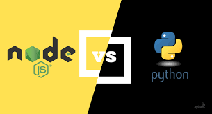

# Warcraft III Sticker bot

## Introduction
---

Это мой бот, написанный на **Node JS**, который напомнит вам о такой захватывающей стратегии, как **Warcraft III**.

Вы можете найти его по его имени: **@BDW_Warcraft_III_Stickers_bot**

**Warcraft III** существует с далёкого 2002 года и в своё время имел довольно большое comunity.

И мне в свою очередь очень нравилась эта игра. Довольно даже как-то немного обидно, что **Blizzard** "забросили" её, и она потеряла большую аудиторию.

## Backstory
---

Одним прекрасным днём, будучи на просторах **Telegram**, я наткнулся на один стикерпак, который привлёк моё внимание. Это был стикерпак, в котором были собраны разные персонажи из игры **Warcraft III** и некоторые их реплики. На меня нахлынули воспоминания, и в моей голове эти персонажи говорили их голосом (голосом людей, которые их озвучили разумеется). И я решил сделать:
1. Свои собственные стикерпаки **со всеми основными расами**
2. Сделать бота, в котором можно было бы выбрать фразу и **услышать её** в озвучке этого же персонажа из игры

## Brief Conclusion
---
У меня это получилось, поэтому я и размещаю свой код здесь.

## How and why on Earth that works?
--- 

Бот при запуске обрабатывает конфигурационные файлы (для простоты представления я использовал **JSON**), которые формируют всю работу бота. 

Данные в этих конфигурационных файлах это file_ids, и они находятся в открытом доступе, но при этом строго привязаны к одному токену бота (это ограничение самого **Telegram**, и с этим, увы, ничего не сделать) 

## What were the difficulties?
---

Следует отметить, что этот проект был довольно сложным в реализации, и мне пришлось изучить довольно много всего нового, среди всего:
+ Работа с **Adobe Premier Pro** для рендера гифки каждого юнита
+ Парсинг **.mpq** архивов (именно они используются Blizzard во многих её играх)
+ Многочисленная **автоматизация** буквально всех рутиных действий (в этом отношении я нашёл **Python** наиболее подходящим и удобным) [Ссылка на репозиторий]()
+ **Node JS** (это мой первый **не web проект**, написанный на Node JS)
+ **Telegraf** - удобная js библиотека для работы с **Telegram bot API** 

## Why JS but not Python?
---

Я нахожу использование **JavaScript** более удобным для написания Telegram ботов. Да, это спорно, но мне проще поддерживать и расширять Telegram бота, написанного на JS, несмотря на то, что мой первый и основной ЯП - это Python.

## What's for GIFs?
---

У меня есть большие наработки с **гифками каждой реплики каждого персонажа**, однако я посчитал это чрезмерным по некторым причинам, чтобы включать  его в текущую версию проекта. Однако если этот проект получит поддержку со стороны пользователей, и вы (они) захотите видеть помимо всего прочего ещё и гифку к каждой реплике, то сообщите это мне. 

---
### **Также я полностью открыт к новым предложениям относительно проекта**
---

**@BDW_Warcraft_III_Stickers_bot**

---

 > I'm just learning
